## Lab: Health Care Staffing Invoice Generator

### **Part 1: Account Setup and Getting Started**

### **Step 1: Access LangFlow**
1. Open your web browser and navigate to [LangFlow](https://www.langflow.org/).
2. Click on the **Sign Up** button in the top-right corner of the homepage.

### **Step 2: Create an Account**
1. Fill in the required details or Signup using other options.
2. Click the **Sign Up** button.

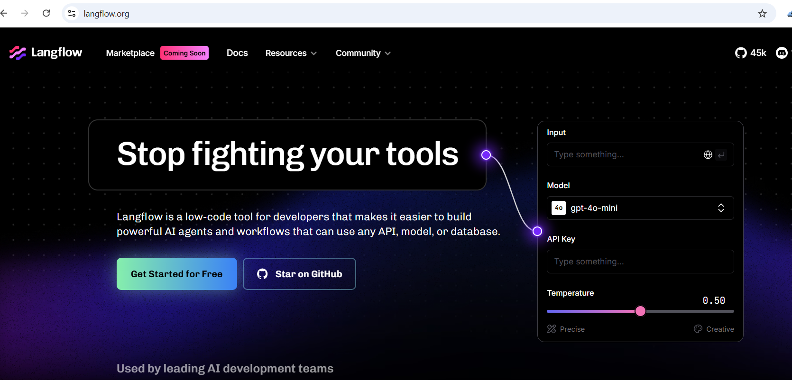

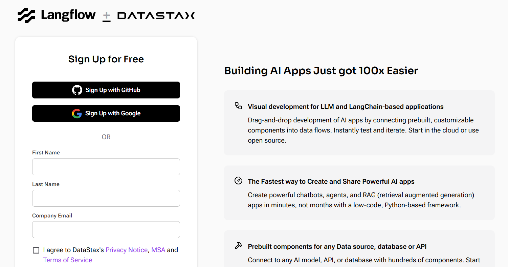


### **Step 3: Verify Your Email (If Required)**
1. Check your inbox for a verification email from LangFlow.
2. Click on the verification link to activate your account.

### **Step 4: Log In**
1. Return to [LangFlow](https://www.langflow.org/) and **Log In**.

---

# **Use Case 1: Health Care Staffing Invoice Generator**

### **Objective**:
Create a flow to:
- Generate invoices for clients.
- Calculate recruiter commissions.
- Summarize placement data.

### **Steps**

#### **Step 1: Create a New Flow**
1. Log in to LangFlow.
2. On the dashboard, click **New Flow**.
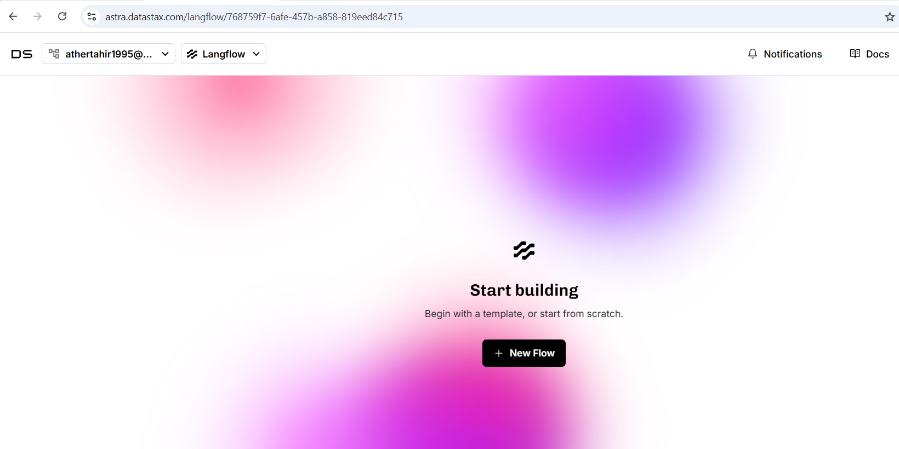

3. Now, click **Blank Flow**.
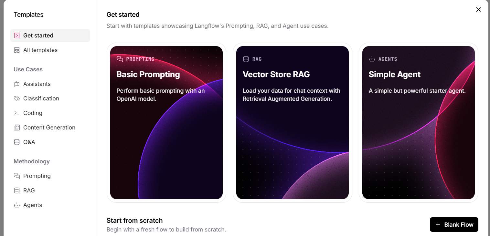

#### **Step 2: Add an Input Node**
1. Drag and drop the **Input** node onto the canvas.
2. Select **Chat Input**.

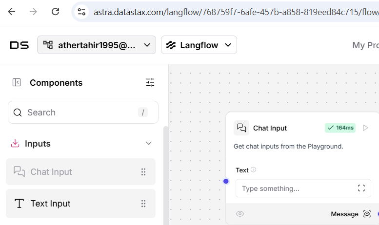

#### **Step 3: Add a Calculation Node**
1. Drag the **Calculation** node to the canvas.
2. Enter Expression: `Recruiter commission (e.g., 10% of placement cost)`.

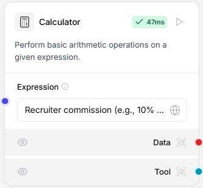

#### **Step 4: Add an Agent Node**
1. Drag the **Agent** node onto the canvas.
2. Connect it to the Calculation node and Input node as show below.
3. Enter `OpenAI` key.

#### **Step 5: Add an Output Node**
1. Drag the **Chat Output** node onto the canvas.
2. Connect it to the `Response` part of `Agent` node.

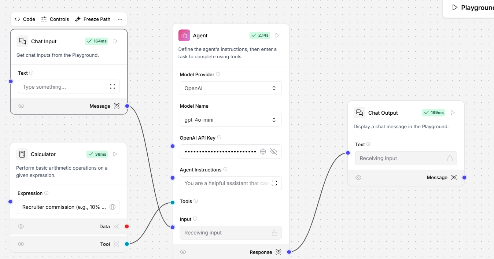

#### **Step 6: Test the Flow**

1. Click Playground button:


2. Enter sample data in the playground:
   ```
   Client: ABC Hospital
   Staff placed: 5
   Placement cost: $20,000

   Give me Recruiter commission (e.g., 10% of placement cost)
   ```

3. Run the flow and review the generated invoice.

   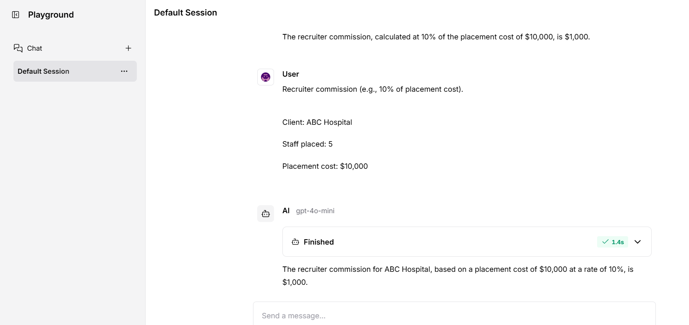


2. Enter new data in the playground to generate invoice:
   ```
   Client: XYZ Hospital

   Nurses: 12
   Doctors : 5
   Radiologist: 3

   Placement cost: $130,000


   Generate an text invoice for above hospital staffing quotes in details. Add 25% misc charges and 1340$ Tax
   ```


3. Run the flow and review the generated invoice.

   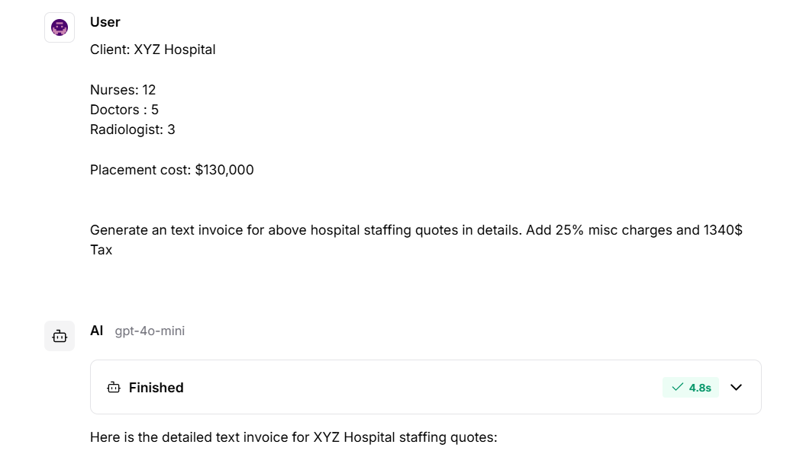

   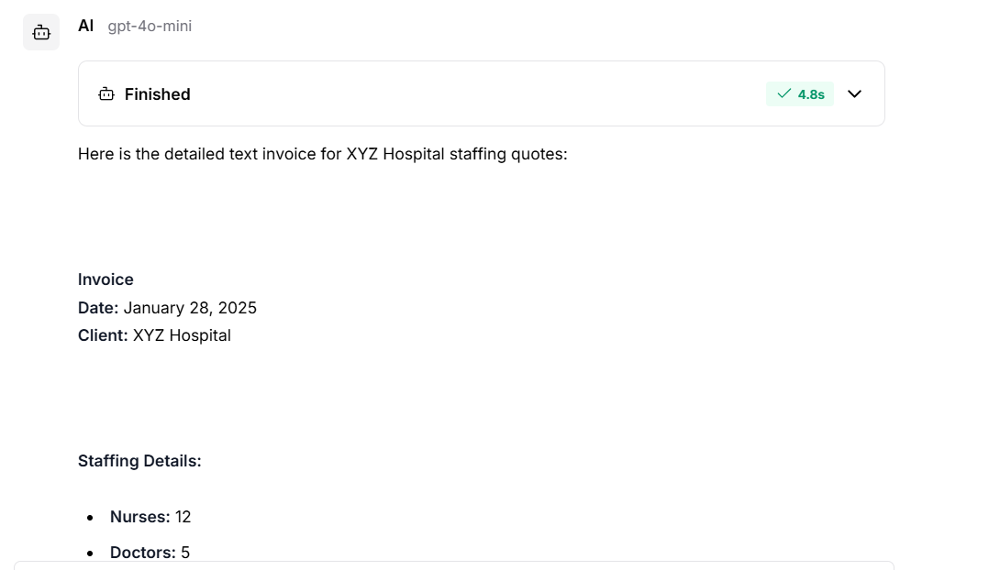

   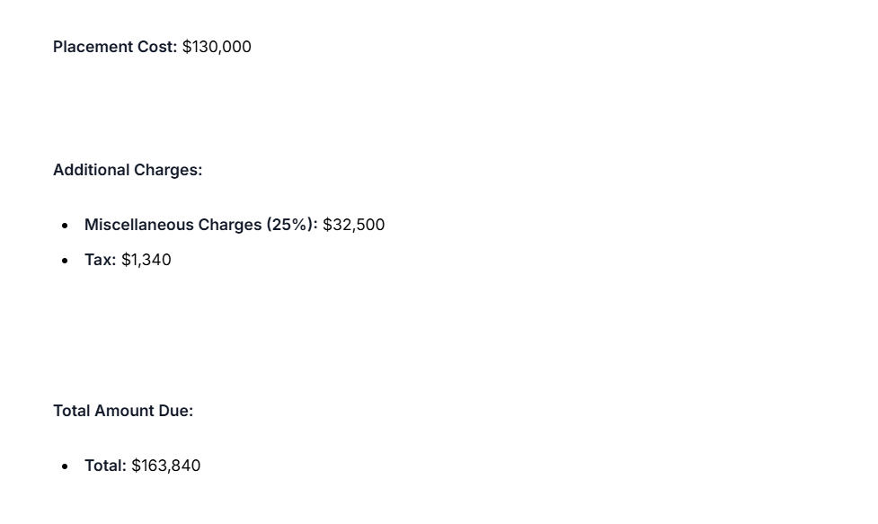


### Task: Explore the Flow

Explore the flow by giving different prompts and bigger calculations.