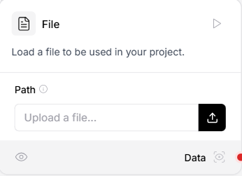
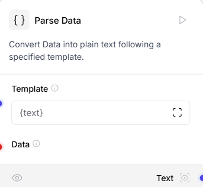
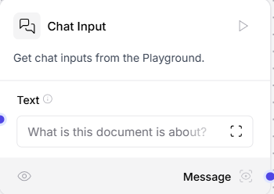
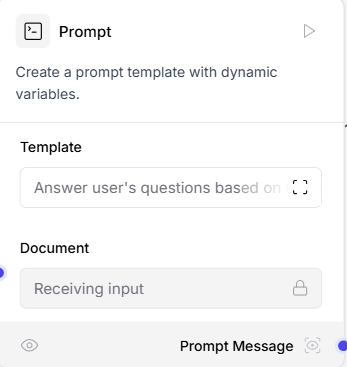
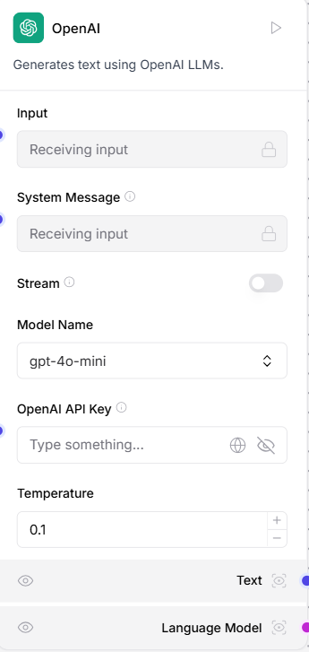
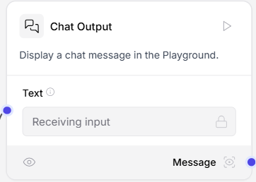
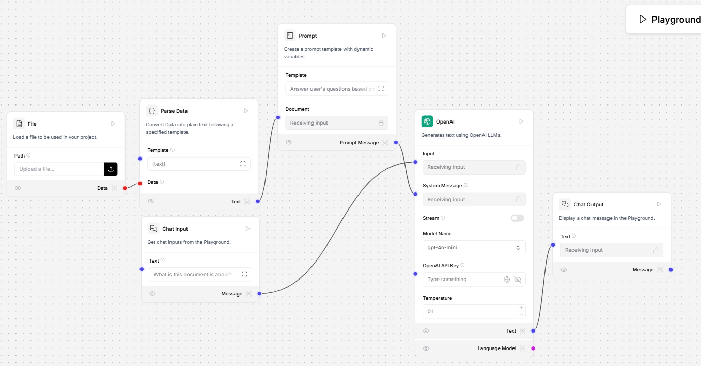
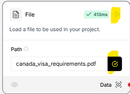
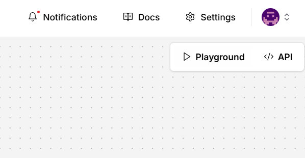
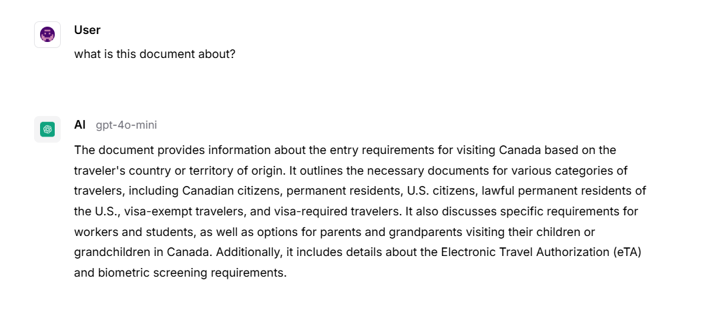

# **Lab: Canadian Federal Government Document Summarizer**

### **Objective**:
Create a flow to:
- Summarize and analyze large government documents.

### **Steps**

#### **Step 1: Create a New Flow**
1. Log in to LangFlow.
2. Click **New Flow** on the dashboard.


#### **Step 2: Add File Node**
1. Drag and drop the **File** node onto the canvas.
2. Configure it to upload:
   - Government policy document `canada_visa_requirements.pdf` from the GitHub repo.



#### **Step 3: Add Parse Data Node**
1. Drag and drop the **Parse Data** node onto the canvas.
2. Set **Template** to `{text}`.



#### **Step 4: Add Chat Input Node**
1. Drag and drop the **Chat Input** node onto the canvas.
2. Set **Text** to `What is this document is about?`.



#### **Step 5: Add Prompt Node**
1. Drag and drop the **Prompt** node onto the canvas.
2. Set **Template** to the following:
   ```
   Answer user's questions based on the document below:

   ---

   {Document}

   ---

   Question:
   ```




#### **Step 6: Add OpenAI Node**
1. Drag the **OpenAI** node onto the canvas.
2. Enter `OpenAI API Key` key.




#### **Step 7: Add Chat Output Node**
1. Drag and drop the **Chat Output** node onto the canvas.



#### **Step 8: Connect all nodes as shown below:**

Connect all the nodes as shown below:



#### **Step 8: Test the Flow**

1. Upload file `canada_visa_requirements.pdf` and click **Run** icon:



2. Click Playground button:



3. Enter sample data in the playground:
   - What is this document is about?
   - Do people from United States need to apply for Visa?
   - Do people from SouthAfrica need to apply for Visa?
   - What is the requirement for Workers and students visa?




